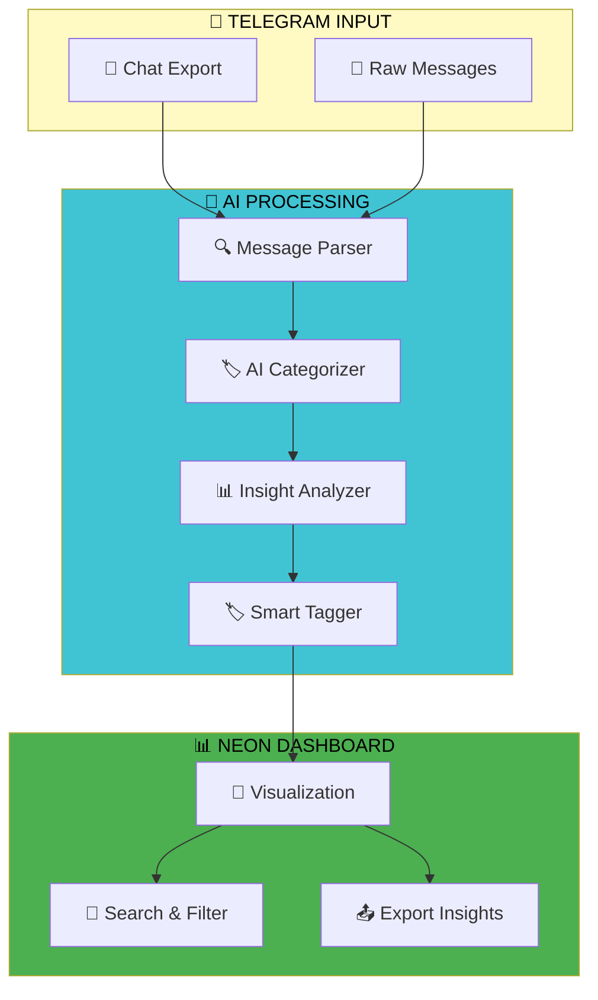

# telelens-telegram-dashboard
Transform messy Telegram chat exports into organized, actionable insights with AI-powered categorization. Neon Chrome aesthetic.

## 🗺️ System Architecture

```mermaid
flowchart TD
    subgraph Input["📩 TELEGRAM INPUT"]
        Export["📄 Chat Export"]
        Raw["💬 Raw Messages"]
    end

    subgraph Processing["🤖 AI PROCESSING"]
        Parser["🔍 Message Parser"]
        Categorizer["🏷️ AI Categorizer"]
        Analyzer["📊 Insight Analyzer"]
        Tagger["🏷️ Smart Tagger"]
    end

    subgraph Dashboard["📊 NEON DASHBOARD"]
        Visual["🎨 Visualization"]
        Search["🔎 Search & Filter"]
        Export2["📤 Export Insights"]
    end

    Export --> Parser
    Raw --> Parser
    Parser --> Categorizer
    Categorizer --> Analyzer
    Analyzer --> Tagger
    Tagger --> Visual
    Visual --> Search
    Visual --> Export2

    style Input fill:#FFF9C4,color:#000
    style Processing fill:#40C4D4,color:#000
    style Dashboard fill:#4CAF50,color:#000
```
